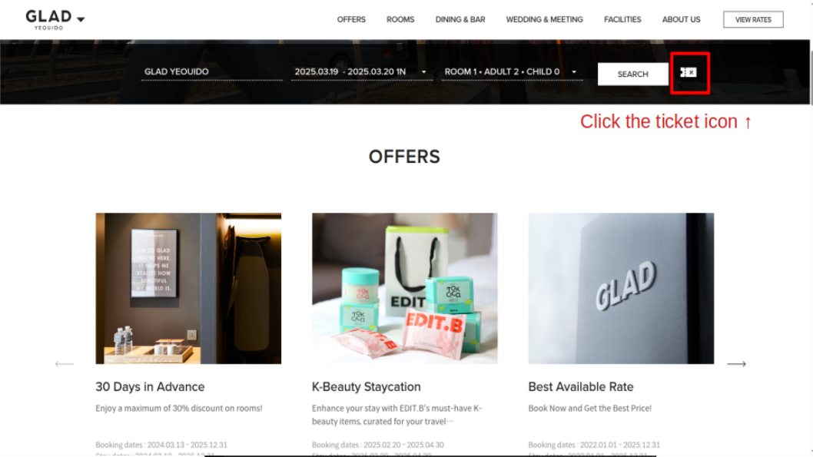
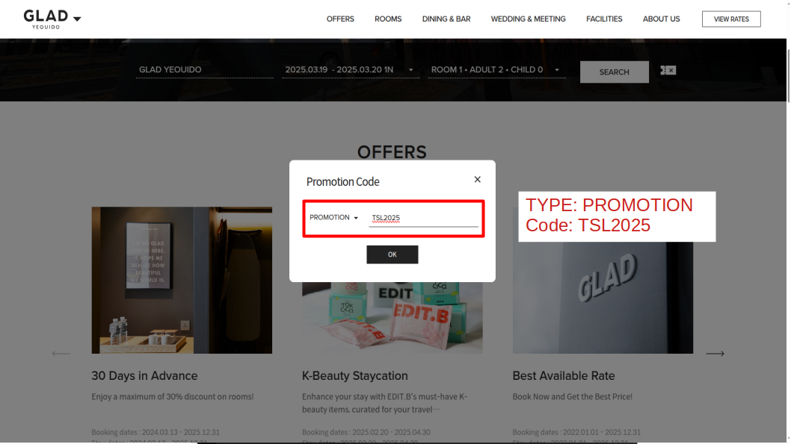
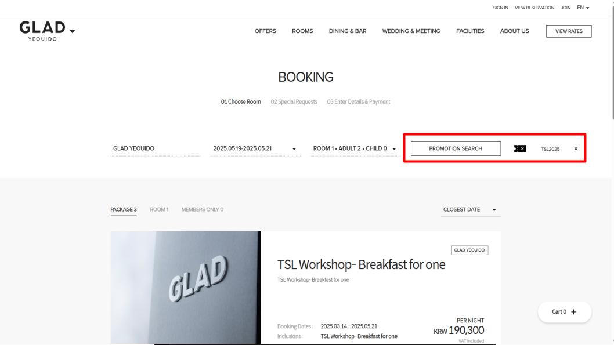

# Workshop Venue  

We are pleased to welcome you to the **GLAD Hotel Yeouido Seoul**, the official venue for our workshop.  

📍 **Location:** 16, Uisadang-daero, Yeongdeungpo-gu, Seoul  
🔗 [Hotel Website](https://www.glad-hotels.com/yeouido/index.do?locale=en)  
📍 [View on Google Map](https://maps.app.goo.gl/YHT8KQnnpna6hvMw5)  

---

## Hotel Reservation  

A special room rate is available for workshop participants. You can book your stay using the promotional code below.  

🔗 [Reserve Your Room](https://www.glad-hotels.com/yeouido/index.do)  
**Promotion Code:** `TSL2025`  

We encourage you to book early to secure your preferred accommodation.  

### How to Book a Hotel Using the Promotion Code

Follow the steps below to book a hotel using the promotion code:

1. **Visit the official website** and click on the **ticket icon** located to the right of the **Search** button.   

2. A pop-up window will appear, prompting you to enter the promotion code.  **Select "Promotion"** as the type, enter **TSL2025** as the code, and click **OK** to apply it.  

3. If the promotion code is successfully applied, you will see **"Promotion Search"** as shown in the image below, and the **promotional room options** will be displayed in the search results.

---

## Transportation  

### ✈️ Distance to the Hotel  
- **Incheon International Airport:** 52.5 km  
- **Gimpo International Airport:** 13.45 km  

### 🚕 By Taxi  
- **From Incheon International Airport to GLAD Yeouido**  
  - **General Taxi:** Approx. **KRW 50,000**  
  - **Deluxe Taxi:** Approx. **KRW 90,000**  

### 🚇 By Subway  
- Take **Seoul Subway Line 9** and get off at **National Assembly Station**.  
- Use **Exit 4**, and the hotel is just a short walk away.  

If you need any assistance with your travel arrangements, please do not hesitate to contact us. We look forward to welcoming you to the workshop!  
